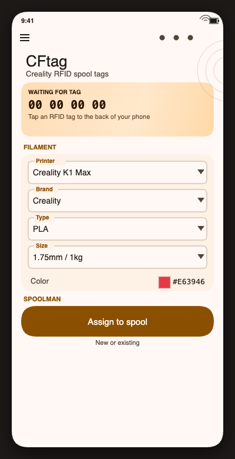
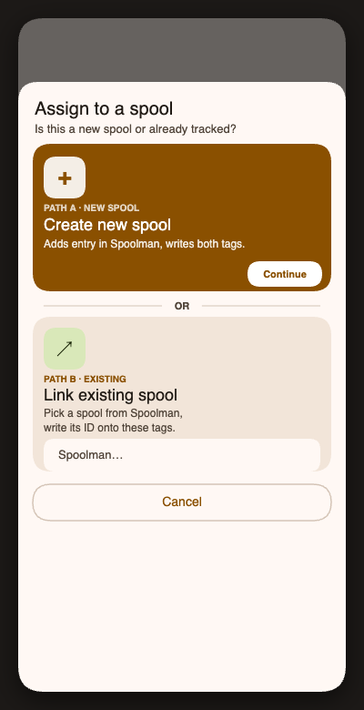
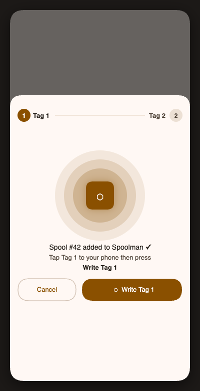
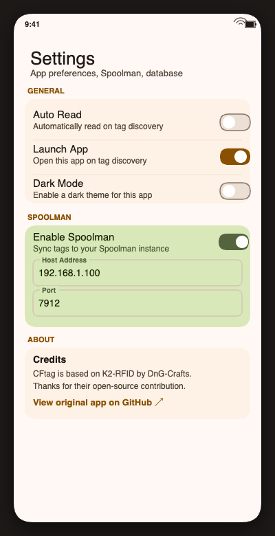

# CFtag

An Android app for reading and writing Creality RFID filament spool tags. Works alongside [CFsync](https://github.com/koen01/Filament-Management) and [Spoolman](https://github.com/Donkie/Spoolman) to give you a seamless, end-to-end filament tracking workflow.

> Based on the excellent [K2-RFID](https://github.com/DnG-Crafts/K2-RFID) by DnG-Crafts — big thanks for their hard work and open-source contribution.

---

## What it does

Creality K1/K2/Hi/CFS printers use MIFARE Classic 1K NFC tags on filament spools to identify filament type, colour, and vendor. CFtag lets you read and write those tags from your Android phone — so you can tag your own spools, re-tag spools with different filament, or link a physical tag directly to a Spoolman spool entry.

When used together with **CFsync** and **Spoolman**, the full loop looks like this:

```
CFtag (phone)  ──write──▶  RFID tag on spool
                              │
                              └──▶  Creality printer reads tag, knows filament
CFtag          ──REST──▶   Spoolman  ◀──sync──  CFsync
                              │
                              └──▶  Usage tracking, remaining weight, history
```

1. **CFtag** writes filament data + a Spoolman spool ID onto the RFID tag.
2. The printer reads the tag and selects the correct filament profile automatically.
3. **CFsync** syncs filament data between your printer and Spoolman.
4. **Spoolman** tracks remaining weight and usage history across all your spools.

---

## Screenshots

<p align="center">
  
  
  
  
</p>
<p align="center">
  <em>Main screen &nbsp;·&nbsp; Assign to spool &nbsp;·&nbsp; Write tag flow &nbsp;·&nbsp; Settings</em>
</p>

---

## Key features

### Dual-tag write in one session
Many spools ship with two RFID tags. CFtag guides you through writing both in a single flow — no need to re-open the app or re-enter filament details. After writing Tag 1 you are prompted to tap Tag 2 and press **Write Tag 2**. Both tags end up with identical data including the linked Spoolman spool ID.

### Spoolman integration
- **Write & Create Spool** — fill in filament details, press the button, and CFtag creates the spool in Spoolman and immediately guides you through writing both tags.
- **Link to Existing Spool** — pick an existing Spoolman spool from a searchable list (with colour swatch and remaining weight) and write the link onto the tag(s).
- The Spoolman spool ID is stored in the tag's serial number field, creating a stable cross-system identifier between the physical tag, the printer, and Spoolman.

### Read existing tags
Tap **Read** (or enable auto-read in settings) to read any Creality-compatible RFID tag and display its full filament information.

### Filament database
Ships with the Creality filament database. You can download an updated database directly from a connected printer over the local network.

---

## Requirements

- Android phone with NFC
- MIFARE Classic 1K NFC tags (the standard Creality spool tag format)
- Creality K1 / K2 / Hi / CFS series printer
- (Optional) [Spoolman](https://github.com/Donkie/Spoolman) instance on your local network
- (Optional) [CFsync](https://github.com/koen01/Filament-Management) for printer ↔ Spoolman sync

---

## Setup

1. Install the APK on your Android device.
2. Open the app and tap the menu icon → **Settings**.
3. Enable **Spoolman** and enter your Spoolman host address and port (default `7912`).
4. Select your **Printer** model and **Brand** from the dropdowns.
5. You are ready to start tagging spools.

> **Note:** Some Android devices do not support MIFARE Classic tags at the hardware level. If RFID functions are shown as disabled after enabling NFC, your device is not compatible.

---

## Usage

### Writing a new spool (with Spoolman)

1. Select **Printer**, **Brand**, **Type**, **Size**, and **Color** from the dropdowns.
2. Under **SPOOLMAN**, tap **Assign to spool**.
3. Choose **Create new spool**, fill in the spool details, and tap **Add**.
4. The spool is created in Spoolman. Tap your first RFID tag to the back of your phone and press **Write Tag 1**.
5. When prompted, tap your second tag and press **Write Tag 2**.
6. Done — both tags are written and linked to the Spoolman spool.

### Linking an existing Spoolman spool

1. Select the filament options for this spool.
2. Under **SPOOLMAN**, tap **Assign to spool** → **Link existing spool**.
3. Pick the spool from the list (searchable by name or vendor).
4. Follow the Tag 1 / Tag 2 prompts as above.

### Reading a tag

Tap **Read** with an NFC tag near the back of your phone (or enable auto-read in settings to have it read automatically on tag discovery).

---

## ESP32 Hardware Option

Don't have an Android phone with MIFARE Classic support? There's an ESP32-based alternative.

The `Arduino/ESP32/` folder contains firmware for the [K2-RFID ESP32 hardware](https://github.com/DnG-Crafts/K2-RFID/tree/main/Arduino/ESP32) — a drop-in replacement that serves a web interface mirroring the app's functionality.

**Same hardware, same wiring** (RC522 RFID reader, SS=GPIO5, RST=GPIO21, speaker=GPIO27). Flash the firmware, connect to the `K2_RFID` WiFi AP, open `http://10.1.0.1`.

Features:
- Read and write Creality RFID tags
- Spoolman integration — pick an existing spool or create a new one, write the tag, auto-PATCH the spool with the tag UID
- Two-tag write workflow
- OTA firmware updates
- Runs fully local, no phone needed

See [`Arduino/ESP32/README.md`](Arduino/ESP32/README.md) for build and setup instructions.

---

## Credits

CFtag is a fork of [K2-RFID](https://github.com/DnG-Crafts/K2-RFID) by DnG-Crafts. The core tag format, encryption, and filament database handling are their work.
